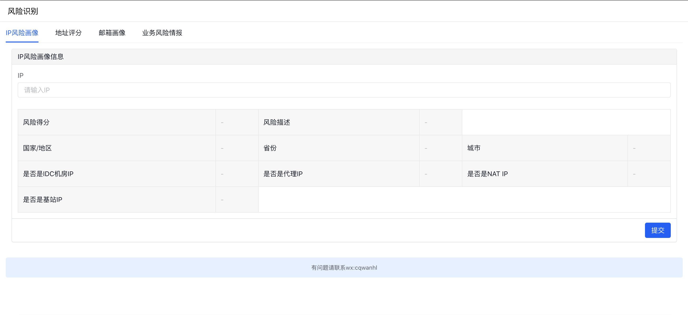

# risk_indetified
可以对[手机号]/[ip]/[邮箱]/[收货地址]进行风险识别

简介：该工具使用Golang+Amis进行开发
主要作用：
  识别用户各种属性的风险值：
适用场景：
  电商活动，例如拉新，秒杀，促销等场景

Install:
  1. 直接下载 二进制包 main ,然后执行 ./main,  如果是window,请执行 /main.exe
  2. 启动端口为9999
  3. 访问页面 http://127.0.0.1:9999
  4. 目前单个ip每天的请求量是100次，如果需要更大量的情景，请联系wx:cqwanhl
 
页面预览：
  
    
